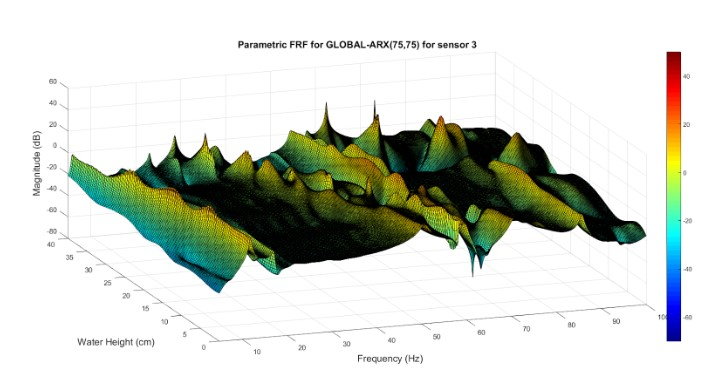
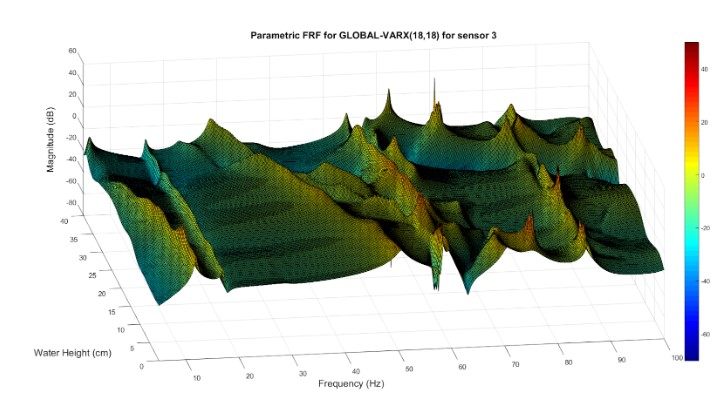

# Creating "Global" ARX and V-ARX models in MATLAB.
Mechanical Engineer Thesis project - Health monitorig via Stochastic Models
----------------------------------------------------------------------

By "global" it is meant that a number of models is created for each observed state and then via cubic interpolation using spline polynomials a final "global" model is created.

Dynamic identification and the estimation of the liquid level in an elevated liquid tank via vibration signal measurements.
----------------------------------------------------------------------
### Abstract
----------------------------------------------------------------------
This study focus on the Dynamic identification and the estimation of the liquid level in an elevated liquid tank via vibration signal measurements. Firstly, a brief explanation of the experimental procedure is made.
In the first section, a parametric analysis of the structure using the stochastic models ARX and VARX for all levels of liquid with available experimental measurements is shown. For the estimation of all models the software that was used is Matlab. Using those two models as a base, two new models were created. The Global-ARX and Global-VARX models are capable of estimating the dynamic characteristics of the structure for all the levels of the liquid, even for levels that don’t have an available experimental measurement. The estimation of the innovative FP-VARX model is also made. This model can also estimate the dynamic characteristics of the structure for all the possible levels of liquid with even better accuracy.

In the next section, the models Global-ARX, Global-VARX and FP-VARX are used for the estimation of the level of the liquid using unknown experimental measurements. Those measurements were not used for the estimation of the models. Then, the real value of the level is compared with the estimated value for every signal. The Global-VARX and FP-VARX models are capable of estimating the level of the liquid with decent accuracy, although the Global-ARX isn’t capable of identifying the level when the liquid tank is full for some measurements. The conclusion of the present study is that the FP-VARX model has the best accuracy in comparison with the other two, but is also the most complex one. The estimations of the less complex model Global-VARX were also decent but with less accuracy. 

----------------------------------------------------------------------
The function PooledARX_all_h is an implementation of an ARX model for system identification. It takes as input a number of experiment data sets, represented as cells x{} and y{}, and estimates an ARX model for each of the experiments. The estimated models are then used to compute the frequency response function (FRF) for the system at different heights. Via cubic interpolation using Spline polynomials.The code also includes some visualizations of the computed FRF.

Here is an example:

----------------------------------------------------------------------
The function kestimationPooledARX.m is used to make predictions for the state of the structure using the model created by PooledARX_all_h.

----------------------------------------------------------------------
The function PooledVARX_all_h is an implementation of an Vector - ARX model for system identification. It takes as input a number of experiment data sets, represented as cells x{} and y{}, and estimates an ARX model for each of the experiments. The estimated models are then used to compute the frequency response function (FRF) for the system at different heights. Via cubic interpolation using Spline polynomials.The code also includes some visualizations of the computed FRF.

Here is an example:

----------------------------------------------------------------------
The function kestimationPooledVARX.m is used to make predictions for the state of the structure using the model created by PooledVARX_all_h.
